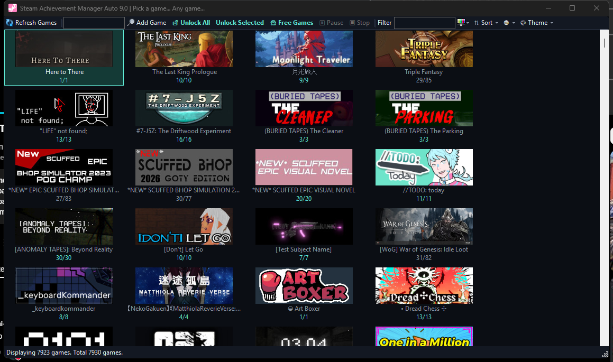
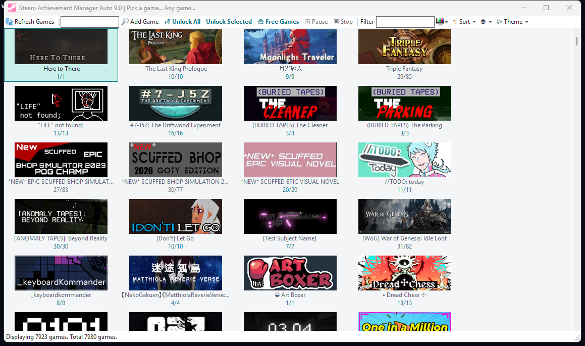
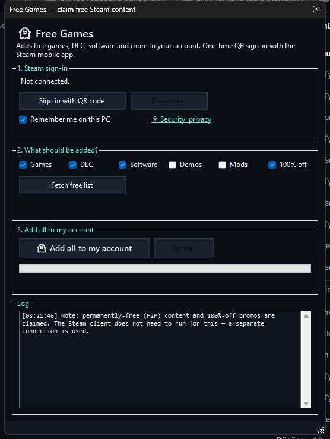
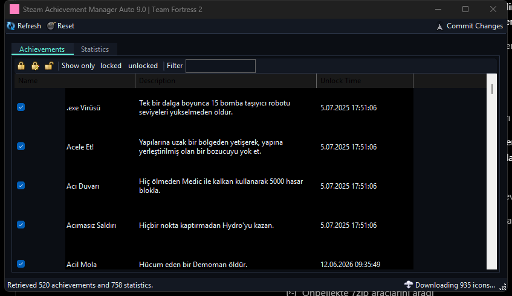

# Steam Achievement Manager Auto 9.0

[](https://github.com/lazhayalet/SteamAchievementManager-Auto/releases)
[](./LICENSE.txt)


Bu proje, [gibbed/SteamAchievementManager](https://github.com/gibbed/SteamAchievementManager)'in güncellenmiş ve **otomatik toplu başarı açma** + **bedava oyun/DLC ekleme** özellikleri eklenmiş fork'udur.

This is an updated fork of [gibbed/SteamAchievementManager](https://github.com/gibbed/SteamAchievementManager) with **bulk achievement unlocking** and **free game/DLC claiming**.

## ⬇️ İndir / Download

Hazır paketi **Releases** sayfasından indirin / Grab the ready-to-run package from **Releases**:

👉 https://github.com/lazhayalet/SteamAchievementManager-Auto/releases

- `SAM-Auto-9.0.0-win-x86.zip` dosyasını indirin, bir klasöre çıkarın ve `SAM.Picker.exe` dosyasını çalıştırın.
- Download `SAM-Auto-9.0.0-win-x86.zip`, extract it to a folder and run `SAM.Picker.exe`.
- Kurulum gerekmez, taşınabilirdir / No installation needed, portable.

---

## 📸 Ekran Görüntüleri / Screenshots

| 👻 Hayalet (Koyu) Tema / Ghost (Dark) Theme | ☀️ Açık Tema / Light Theme |
|:---:|:---:|
|  |  |
| 🎁 Bedava Oyunlar / Free Games | 🏆 Başarı Yöneticisi / Achievement Manager |
|  |  |

---

## 🇹🇷 Türkçe

Steam Achievement Manager Auto (SAM Auto 9.0), Steam'deki başarıları ve istatistikleri yönetmek için hafif, taşınabilir bir araçtır. **Steam istemcisi açık olmalı ve giriş yapılmış olmalıdır** (Bedava Oyunlar özelliği için gerekmez, aşağıya bakın).

### Bu fork'a eklenen özellikler

- **🔓 Unlock All** butonu – kütüphanenizdeki **TÜM** oyunların başarılarını tek tıkla açar
- **Unlock Selected** butonu – yalnızca seçtiğiniz oyunların başarılarını açar (çoklu seçim için Ctrl+Click)
- **⏸️⏹️ Duraklat / Durdur** – toplu açma sırasında istediğiniz an duraklatıp devam ettirin ya da tamamen durdurun
- **⏱️ Tahmini süre göstergesi** – toplu açma başlamadan önce onay penceresinde, çalışırken de durum çubuğunda canlı kalan süre
- **🏆 Oyun kartlarında başarı ilerlemesi** – her oyunun altında açılan/toplam başarı sayısı (yerel Steam önbelleğinden, anlık ve internetsiz)
- **⇅ Sıralama seçenekleri** – isme göre, açılmamışlar önce veya açılmışlar önce
- **👻 Bedava Oyunlar** – Steam'deki kalıcı bedava içerikleri **ve %100 indirim fırsatlarını** hesabınıza toplu ekler:
  - Kategori seçimi: **Oyunlar / DLC / Yazılım / Demolar / Modlar / %100 fırsatlar**
  - **Şifresiz QR girişi** – Steam mobil uygulamasıyla QR kodu okutmanız yeterli; "beni hatırla" ile bir sonraki açılışta otomatik oturum (oturum Windows DPAPI ile şifreli saklanır)
  - Pencere modal değildir — açıkken ana pencereyi kullanmaya devam edebilirsiniz
  - Liste önbelleği — ikinci açılışta beklemeden hazır sayımlar
  - Canlı ilerleme, sayaçlar (eklendi / zaten sende / hata) ve **tahmini kalan süre**
  - Valve hız limitine (saatte ~50 yeni lisans) takılırsa otomatik bekler ve devam eder
- **👻 Hayalet teması** – tüm pencerelerde modern koyu arayüz, camgöbeği vurgular, koyu başlık çubuğu
- **🌐 TR/EN dil seçeneği** – araç çubuğundaki 🌐 menüsünden anında dil değiştirme
- Gizli otomatik mod: `SAM.Game.exe <appId> --unlock-all` tek oyunu arayüzsüz açar, sonucu `SAM_AutoUnlock.log` dosyasına yazar ve çıkar

> ⚠️ **Dikkat:** Toplu açılan başarılar Steam profilinizde görünür ve geri alınamaz. Bedava içerik ekleme de hesabınıza kalıcı lisanslar ekler. Sorumlu kullanın.

### Kullanım

1. Steam'i açın ve giriş yapın
2. **Releases** sayfasından `SAM-Auto-9.0.0-win-x86.zip` dosyasını indirin
3. ZIP dosyasını bir klasöre çıkarın
4. Çıkarılan klasörden `SAM.Picker.exe` dosyasını çalıştırın
5. Araç çubuğundaki **🔓 Unlock All** / **Unlock Selected** veya **👻 Bedava Oyunlar** butonunu kullanın

### Bedava Oyunlar nasıl çalışır?

1. **👻 Bedava Oyunlar** butonuna tıklayın
2. **QR kod ile giriş yap** → Steam mobil uygulamasıyla QR kodu okutun (şifre gerekmez, oturum bu bilgisayarda şifreli saklanır)
3. Eklemek istediğiniz kategorileri işaretleyip **Bedava listesini getir** deyin
4. **Hepsini hesabıma ekle** → ilerlemeyi ve tahmini süreyi canlı izleyin

Bu özellik kendi bağımsız Steam ağ bağlantısını kullanır (SteamKit2); Steam istemcisinin açık olması şart değildir.

### Kurulum / Build

Gereksinim: Windows üzerinde [.NET 8 SDK](https://dotnet.microsoft.com/download) (derleme için) + çalıştırma için .NET Framework 4.8.

```
dotnet build SAM.sln -c Release -p:Platform=x86
```

Çalıştırılabilir dosyalar `upload` klasöründe oluşur. .NET Framework 4.8 referansları `Directory.Build.props` ile otomatik yüklenir.

---

## 🇬🇧 English

Steam Achievement Manager Auto (SAM Auto 9.0) is a lightweight, portable application used to manage achievements and statistics in Steam. **The Steam client must be running and you must be logged in** (not required for the Free Games feature, see below).

### Features added in this fork

- **🔓 Unlock All** button – unlocks achievements for **every** game in your library with one click
- **Unlock Selected** button – unlocks achievements only for selected games (Ctrl+Click for multi-select)
- **⏸️⏹️ Pause / Stop** – pause and resume bulk unlocking at any time, or stop it entirely
- **⏱️ Estimated time** – shown in the confirmation dialog before bulk unlocking and live in the status bar while running
- **🏆 Achievement progress on game cards** – unlocked/total count under every game (read from the local Steam cache, instant and offline)
- **⇅ Sort options** – by name, locked first or unlocked first
- **👻 Free Games** – bulk-claim permanently free Steam content **and 100%-off promos** to your account:
  - Category selection: **Games / DLC / Software / Demos / Mods / 100% off deals**
  - **Passwordless QR sign-in** – just scan the QR code with the Steam mobile app; "remember me" restores the session automatically next time (session stored encrypted with Windows DPAPI)
  - Non-modal window — keep using the main window while it's open
  - List cache — instant counts on the next open
  - Live progress, counters (added / already owned / failed) and a **live ETA**
  - Automatically waits out Valve's rate limit (~50 new licenses per hour) and continues
- **👻 Ghost theme** – modern dark UI with cyan accents and a dark title bar on every window
- **🌐 TR/EN language option** – switch language instantly from the 🌐 menu in the toolbar
- Headless auto mode: `SAM.Game.exe <appId> --unlock-all` unlocks all achievements for a single game without opening the UI, logs to `SAM_AutoUnlock.log`, and exits

> ⚠️ **Warning:** Unlocked achievements are visible on your Steam profile and cannot be undone. Claimed free content adds permanent licenses to your account. Use responsibly.

### Usage

1. Start Steam and log in
2. Download `SAM-Auto-9.0.0-win-x86.zip` from the **Releases** page
3. Extract the ZIP file to a folder
4. Run `SAM.Picker.exe` from the extracted folder
5. Use the **🔓 Unlock All** / **Unlock Selected** or **👻 Free Games** buttons in the toolbar

### How Free Games works

1. Click **👻 Free Games**
2. **Sign in with QR code** → scan with the Steam mobile app (no password needed; the session is stored encrypted on this PC)
3. Check the categories you want and click **Fetch free list**
4. **Add all to my account** → watch live progress and ETA

This feature uses its own independent Steam network connection (SteamKit2); the Steam client does not have to be running for it.

### Building

Requires the [.NET 8 SDK](https://dotnet.microsoft.com/download) on Windows (+ .NET Framework 4.8 to run).

```
dotnet build SAM.sln -c Release -p:Platform=x86
```

The binaries are written to the `upload` folder. .NET Framework 4.8 reference assemblies are restored automatically via `Directory.Build.props`.

---

## Attribution / Kaynak

Most (if not all) icons are from the [Fugue Icons](https://p.yusukekamiyamane.com/) set.

Based on [gibbed/SteamAchievementManager](https://github.com/gibbed/SteamAchievementManager), Zlib license. See [LICENSE.txt](./LICENSE.txt).

Free Games feature uses [SteamKit2](https://github.com/SteamRE/SteamKit) (LGPL-2.1) and [QRCoder](https://github.com/codebude/QRCoder) (MIT).
